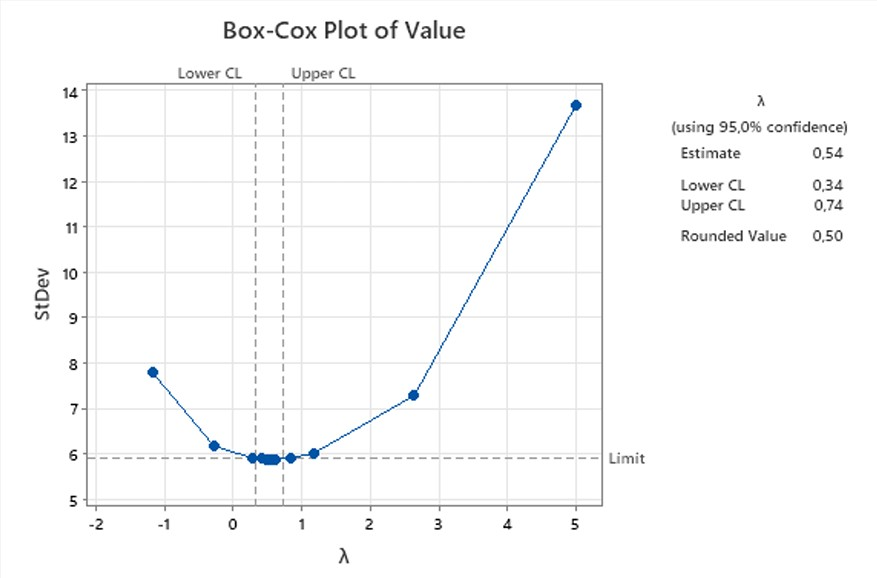
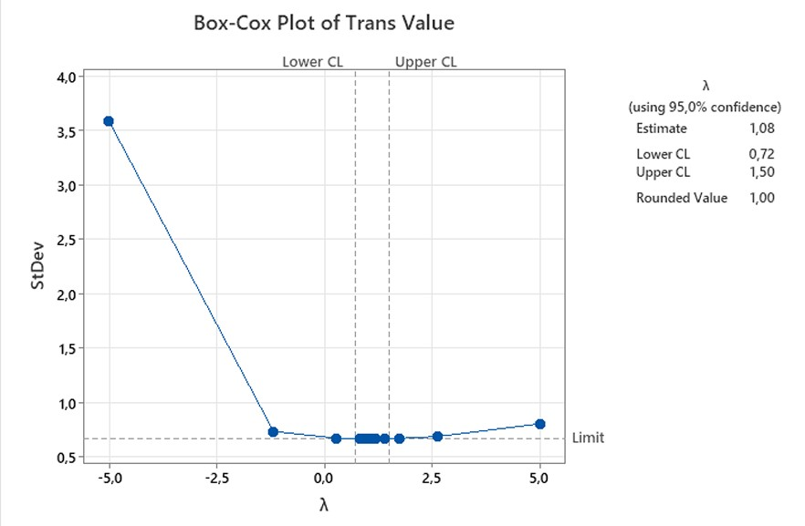

```{r setup, include=FALSE}
knitr::opts_chunk$set(echo = TRUE)
```

## Introduction
This project was carried out during my internship. The data used consists of inpatient admission records from a hospital covering the period from 07/03/2022 to 10/11/2023. However, to maintain institutional confidentiality, the data in this repository has been modified while retaining characteristics similar to the original data.

## Load Library

```{r, message=FALSE, warning=FALSE}
library(stats)
library(tidyverse)
library(tseries)
library(forecast)
library(dplyr)
library(readxl)
library(MASS)
library(lmtest)
library(nortest)
library(readr)
```

## Load Data

```{r}
data <- read_csv("Data/data_pengunjung.csv", col_types = cols(
  Tanggal = col_date(format = "%d/%m/%Y"),
  Hari = col_character(),
  Value = col_double(),
  Subset = col_character()
))
print(data)
```

## Split Data

```{r}
data_train <- data %>% filter(Subset == "Train")
data_fix <- ts(data_train$Value, frequency = 7, start = c(1, 1))
```

## Descriptive Statistics

```{r}
summary_stats <- data_train %>%
  summarize(
    Mean = mean(Value, na.rm = TRUE),
    Median = median(Value, na.rm = TRUE),
    Min = min(Value, na.rm = TRUE),
    Max = max(Value, na.rm = TRUE)
  )
summary_stats
```

Based on the output, the average number of inpatient admissions at the hospital is `r summary_stats$Mean` patients. The lowest number of admissions occurred on `r data_train$Tanggal[which.min(data_train$Value)]` with `r summary_stats$Min` patients, while the highest occurred on `r data_train$Tanggal[which.max(data_train$Value)]` with `r summary_stats$Max` patients.

## Daily Patient arrivals

```{r}
summary_by_day <- data_train %>%
  group_by(Hari) %>%
  summarize(Mean = mean(Value, na.rm = TRUE)) %>%
  arrange(factor(Hari, levels = c("Mon", "Tue", "Wed", "Thu", "Fri", "Sat", "Sun")))
summary_by_day
```

Based on the output, the highest average number of patient arrivals occurred on `r summary_by_day$Hari[which.max(summary_by_day$Mean)]` and the lowest occurred on `r summary_by_day$Hari[which.min(summary_by_day$Mean)]`.

## Time Series Visualization

```{r}
ggplot(data_train, aes(x = Tanggal, y = Value)) +
  geom_line() +
  labs(title = "Time Series Kedatangan Pasien", x = "Tanggal", y = "Jumlah Kedatangan") +
  theme_minimal()
```

From the plot above, the number of inpatient admissions fluctuates significantly, but no clear trend is observed. It can also be seen that inpatient visits tend to follow a weekly cycle, rising and falling every seven days. The increase usually starts on Monday, peaks on Wednesday, and then begins to decline on Saturday. The lowest number of inpatient admissions typically occurs on Sunday, as some clinics are closed, preventing patient transfers from outpatient to inpatient care. This indicates a seasonal pattern in the number of inpatient admissions.

## Stationarity Check

### Stationarity Test on Variance
The stationarity check on variance is performed using Box-Cox transformation. The results are as follows


Based on the output, the rounded value obtained is 0.5, indicating the need for transformation. The transformation is performed using the formula 𝑍𝑡 = √𝑌𝑡, and the results are displayed in the output below.

```{r}
lambda <- BoxCox.lambda(data_fix)
data_fix_transformed <- BoxCox(data_fix, lambda)
```


Based on the output, the rounded value obtained is 1, indicating that the transformed data is now stationary in variance. The next step is to check for stationarity in the mean.


### Stationarity Test on Mean
The stationarity check on the mean can be performed using the ACF and PACF plots of the transformed data.

```{r}
acf(data_fix_transformed, main = "ACF: Data Non-Differencing")
pacf(data_fix_transformed, main = "PACF: Data Non-Differencing")
```

The output shows that ACF exhibits a slowly dying down sinusoidal pattern, indicated by autocorrelation values consistently exceeding the confidence interval at each lag. Therefore, the data is not yet stationary in the mean. Additionally, the sinusoidal pattern suggests that the data is seasonal. This pattern typically appears as a regular wave-like fluctuation at specific lags, reflecting a recurring seasonal period of 38 in the data. Subsequently, seasonal differencing is performed on the transformed data using a lag of 7.

#### Differencing for Stationarity

```{r}
data_diff_fix <- diff(data_fix_transformed, lag = 7, differences = 1)
acf(data_diff_fix, main = "ACF: Data Differencing")
pacf(data_diff_fix, main = "PACF: Data Differencing")
```

Based on the output, it can be seen that the ACF pattern no longer slowly dies down, indicating that the differenced data is now stationary in terms of the mean. Data that is stationary in both variance and mean can be modeled based on the ACF and PACF plots. The output sequentially presents the ACF and PACF plots of the stationary data. Based on the ACF plot, there is a spike at lag 2 followed by a cut-off after lag 2. Additionally, for the seasonal component, there is a spike at lag 7 with a cut-off after lag 7. Meanwhile, the PACF plot shows a gradually decreasing pattern at seasonal levels, specifically at lags 7, 14, 21, and 28. Based on the plot analysis, the suspected SARIMA models are SARIMA(0,0,2)(0,1,1)7, SARIMA(0,0,[2])(0,1,1)7, and SARIMA(0,0,2)(1,1,1)7.


## SARIMA Modeling

```{r}
model_SARIMA1 <- Arima(data_fix_transformed, order = c(0,0,2), seasonal = list(order = c(0,1,1), period = 7))

model_SARIMA2 <- Arima(data_fix_transformed, order = c(0,0,2), seasonal = list(order = c(1,1,1), period = 7))

model_SARIMA3 <- Arima(data_fix_transformed, order = c(0,0,7), seasonal = list(order = c(0,1,1), period = 7), fixed = c(0, NA, rep(0, 4), 0, NA))
```

## Testing SARIMA Model Parameter  
The next analysis involves estimating the parameters of all suspected models using the **Conditional Least Squares (CLS)** method. Then, the significance of these model parameters is tested.

```{r}
coeftest(model_SARIMA1)
coeftest(model_SARIMA2)
coeftest(model_SARIMA3)
```
Based on the output, all p-values are greater than 𝛼 = 0.05, indicating that the parameters of each SARIMA model are significant. Therefore, the analysis proceeds with the diagnostic check.  

## Diagnostic Check  
The diagnostic check is conducted to assess whether the errors in the data are random or independent and follow a normal distribution. The randomness of errors is examined using the Ljung-Box test.

```{r}
lags <- c(7,14,21,28,35)
diagnostic_tests <- function(model, lags) {
  ljung_box_results <- lapply(lags, function(lag) {
    test <- Box.test(model$residuals, type = "Ljung-Box", lag = lag)
    data.frame(Lag = lag, Statistic = test$statistic, p_value = test$p.value)
  })
  
  lillie_test <- lillie.test(model$residuals)
  coef_test <- coeftest(model)
  ljung_box_df <- do.call(rbind, ljung_box_results)
  lillie_test_df <- data.frame(Test = "Lilliefors", Statistic = lillie_test$statistic, p_value = lillie_test$p.value)
  
  list(Coefficient_Test = coef_test, Ljung_Box = ljung_box_df, Lilliefors = lillie_test_df)
}

```


```{r}
result_SARIMA1 <- diagnostic_tests(model_SARIMA1, lags)
print(result_SARIMA1)

result_SARIMA2 <- diagnostic_tests(model_SARIMA2, lags)
print(result_SARIMA2)

result_SARIMA3 <- diagnostic_tests(model_SARIMA3, lags)
print(result_SARIMA3)
```

From the output, it can be seen that the suspected SARIMA(0,0,[2])(0,1,1)₇ model has a p-value < 0.05, indicating that the model does not meet the adequacy criteria or that its residuals do not satisfy the white noise assumption. Therefore, the SARIMA(0,0,[2])(0,1,1)₇ model cannot be used.  

For models that satisfy the white noise assumption, the next step is to test whether the residuals follow a normal distribution. This is done using the Lilliefors normality test. According to the output, the p-values for both models are greater than alpha or 0.05, indicating that the residuals of SARIMA(0,0,2)(0,1,1)₇ and SARIMA(0,0,2)(1,1,1)₇ follow a normal distribution.  

Since both models meet the white noise assumption and their residuals are normally distributed, they can be used for forecasting.


## Model Evaluation with Test Data  
### Data Preparation  
After going through various stages in the SARIMA method, several suitable models have been identified for forecasting. Next, these models are evaluated based on RMSE and MAPE, with the model having the smallest error selected for forecasting. The evaluation is conducted using test data, covering inpatient admission records from **December 11, 2023, to January 7, 2024**, consisting of **28 observations**. The test data is much smaller than the train data because SARIMA is not well-suited for long-term forecasting. The test data is not included in the training data.

```{r}
data_test <- data[data$Subset == "Test",]
test_data <- data_test[, c("Tanggal", "Value")]
test_data_ts <- ts(test_data$Value, frequency = 7, start = c(1, 1))
test_data_transformed <- BoxCox(test_data_ts, lambda)

```

### Performing Forecasting for All Models That Meet Assumptions

```{r}
forecasts_test_SARIMA1 <- forecast(model_SARIMA1, h = length(test_data_transformed))
forecast_values_test_SARIMA1_original_scale <- InvBoxCox(forecasts_test_SARIMA1$mean, lambda)

forecasts_test_SARIMA2 <- forecast(model_SARIMA2, h = length(test_data_transformed))
forecast_values_test_SARIMA2_original_scale <- InvBoxCox(forecasts_test_SARIMA2$mean, lambda)

```
The forecasting results are shown in the output below.
```{r}
results <- data.frame(
  Date = data_test$Tanggal,
  Day = data_test$Hari,
  Actual_Value = data_test$Value,
  Predicted_Value_SARIMA1 = forecast_values_test_SARIMA1_original_scale,
  Predicted_Value_SARIMA2 = forecast_values_test_SARIMA2_original_scale
)
results
```

### Model Evaluation
```{r}
rmse <- function(actual, predicted) {
  sqrt(mean((actual - predicted)^2))
}

mape <- function(actual, predicted) {
  mean(abs((actual - predicted) / actual)) * 100
}

rmse_SARIMA1 <- rmse(results$Actual_Value, results$Predicted_Value_SARIMA1)
mape_SARIMA1 <- mape(results$Actual_Value, results$Predicted_Value_SARIMA1)

rmse_SARIMA2 <- rmse(results$Actual_Value, results$Predicted_Value_SARIMA2)
mape_SARIMA2 <- mape(results$Actual_Value, results$Predicted_Value_SARIMA2)

summary_df <- data.frame(
  Model = c("SARIMA1", "SARIMA2"),
  RMSE = c(rmse_SARIMA1, rmse_SARIMA2),
  MAPE = c(mape_SARIMA1, mape_SARIMA2)
)
summary_df

```
Based on the output, it can be seen that the SARIMA(0,0,2)(0,1,1)₇ model has the smallest error, making it the best model for forecasting.

```{r}
ggplot(results, aes(x = Date)) +
  geom_line(aes(y = Actual_Value, color = "Actual")) +
  geom_line(aes(y = Predicted_Value_SARIMA1, color = "SARIMA1")) +
  geom_ribbon(aes(ymin = InvBoxCox(forecasts_test_SARIMA1$lower[, 2], lambda), 
                  ymax = InvBoxCox(forecasts_test_SARIMA1$upper[, 2], lambda)), 
              alpha = 0.2, fill = "blue") +
  labs(title = "Actual vs Predicted Values (SARIMA1) with 5% Confidence Intervals",
       x = "Date",
       y = "Value",
       color = "Legend") +
  theme_minimal()
```

The output shows the prediction results for the test data used. From the plot, it can be seen that the SARIMA(0,0,2)(0,1,1)₇ model performs well in forecasting. This is indicated by the predicted values being close to the actual values, and the confidence interval covering all actual values, demonstrating that the model's uncertainty estimation is also reliable.